# ブラウザ上で編集作業を共同で行うための手順

## 1. 準備

1. GitHubアカウントをつくる
    - 参考：[GitHubにサインアップ(Sign up) - 新規ユーザ登録 - Qiita](https://qiita.com/mfunaki/items/e01762475967d4e05a1f)
1. 作成したアカウントでGitHubにログインする

## 2. 自分のアカウントにリポジトリをフォーク(fork)する

mayosuke/cult-of-slyflourishリポジトリのトップ画面右上にある「Fork」書かれたボタンをクリックします。
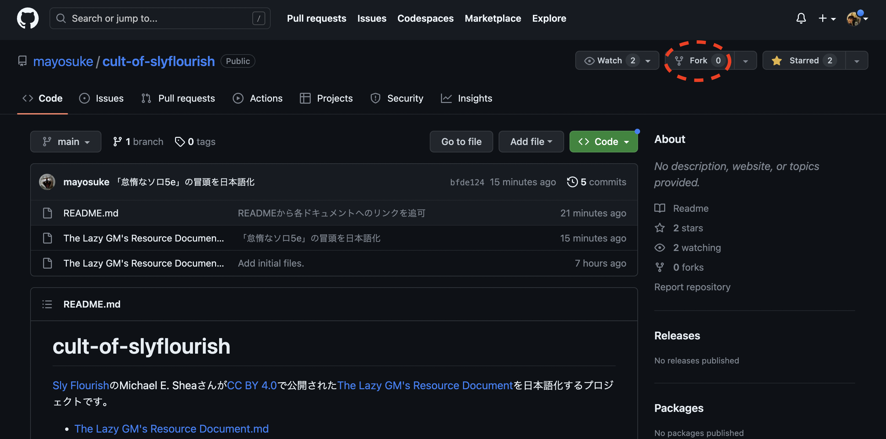

次の画面では、特に何も設定をいじらずに「Create Fork」をクリックします。
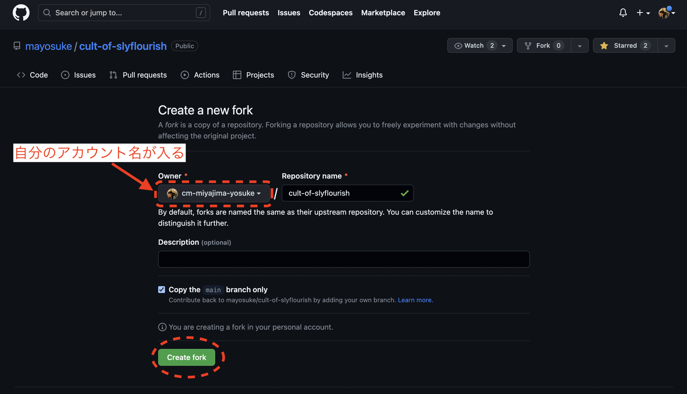

一見、元のリポジトリの画面と違いがわかりづらいですが、画面左上のアカウント名が自分のものになっていることで、元のリポジトリが自分のアカウントにフォークされたことがわかります。
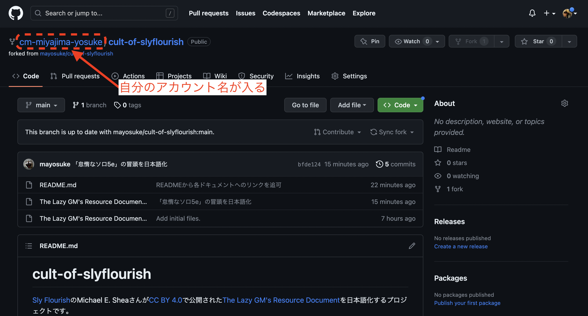

ここまでで、編集作業を開始できるようになりました。

## 3. ブラウザ上で編集を行う

[mayosuke/cult-of-slyflourish](https://github.com/mayosuke/cult-of-slyflourish)に戻り、[The Lazy GM's Resource Document-jp.md](../The%20Lazy%20GM's%20Resource%20Document-jp.md)をクリックします。
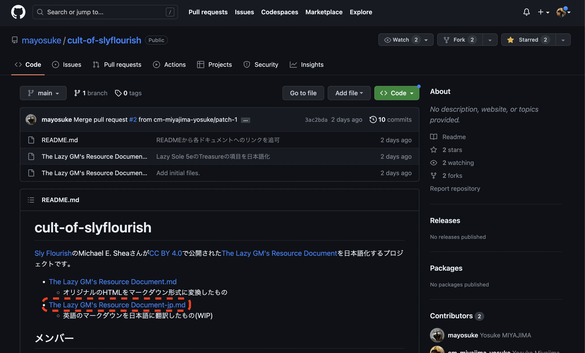

下の画像の赤枠で囲まれている鉛筆型アイコンをクリックします。
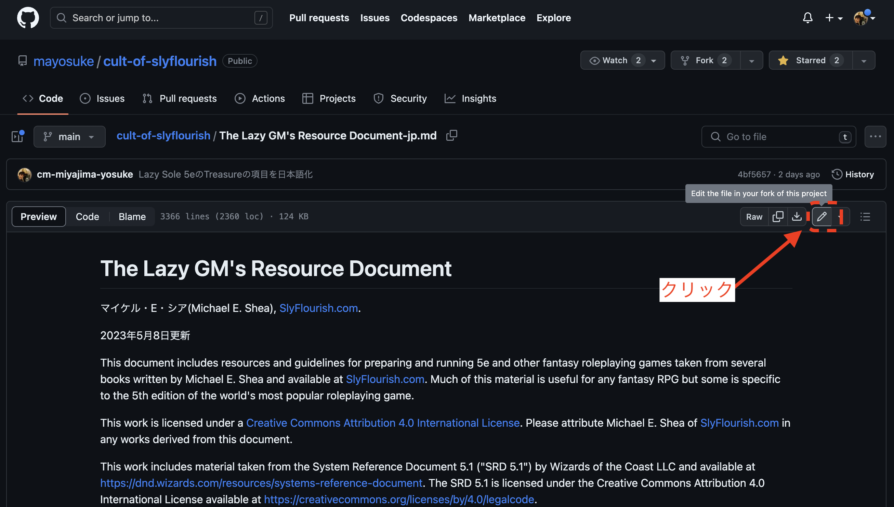

鉛筆アイコンをクリックすると、編集モードに切り替わりドキュメントの編集が開始できます。

**注意：自分のアカウントにフォークしたリポジトリでも編集を行えますが、その場合元のリポジトリ(mayosuke/cult-of-slyflourish)に編集内容を統合（マージ）する作業が若干面倒になるため、自力でなんとかできる方以外は必ず元のリポジトリから編集を行うようにしてください。**
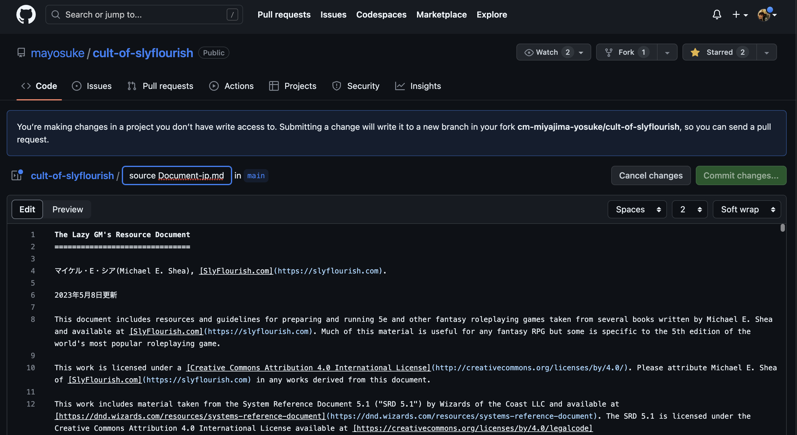

編集の例として、オリジナルのドキュメントの最後のセクション「Lazy Solo 5e」の「Treasures」を日本語化した時の作業の流れを記載します。

「Treasures」はドキュメントの一番最後にあるので、画面を一番下までスクロールさせます。
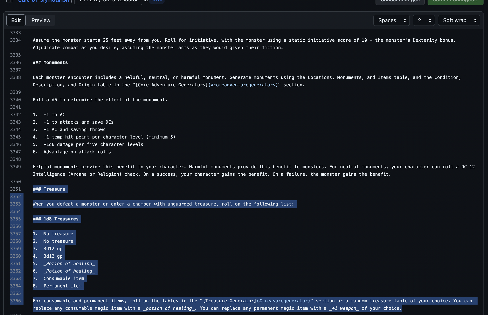

日本語化してみました。
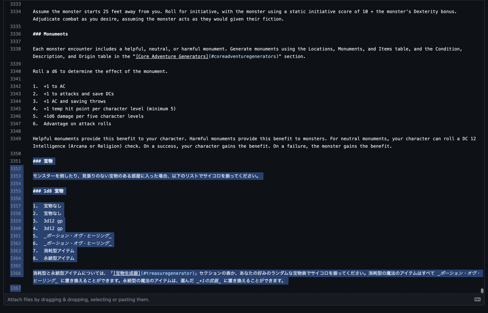

編集内容が期待どおりに表示されるか、プレビューモードで確認できます。エディットエリアの上部左側にある「Preview」ボタンをクリックします。
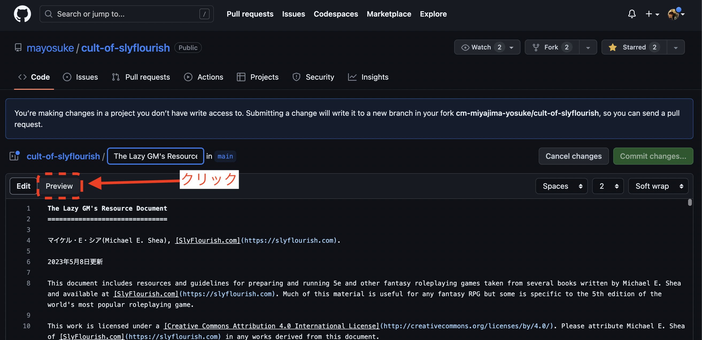

問題なく表示できているようです。

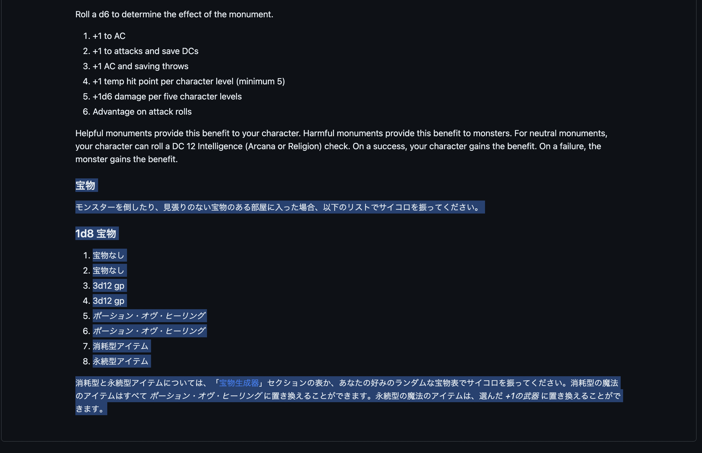

## 編集結果を提出する

編集内容が問題なさそうであれば、元のドキュメントに編集結果を提出しましょう。エディットエリアの上部右側にある「Commit Changes」ボタンをクリックします。
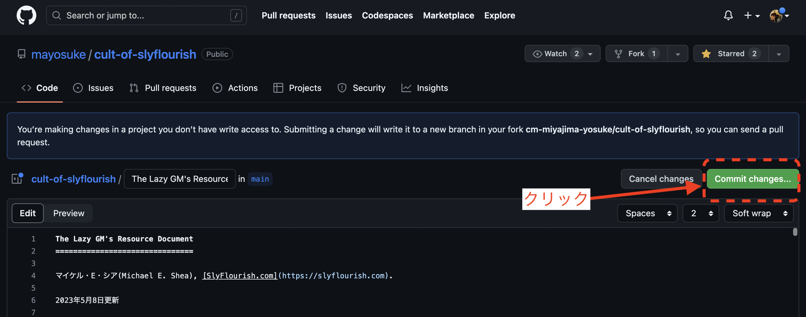

編集内容を記入するポップアップが表示されます。簡潔に編集内容を記入して、「Propose Changes」をクリックします。編集内容について補足などがあれば、「Extended Descriptions」に記入します。
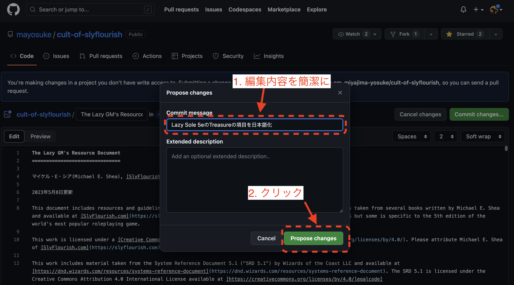

「Create pull request」をクリックすることで、編集結果の提出処理が開始されます。
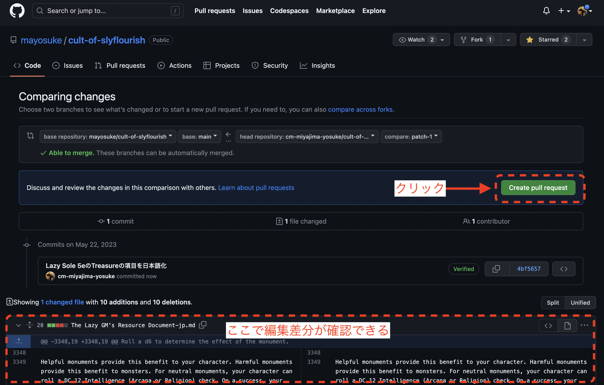

「Create pull request」をクリックする画面を下にスクロールすると、編集差分を確認できます。プレビューで事前に確認してあれば、特にここを気にしなくても大丈夫です。
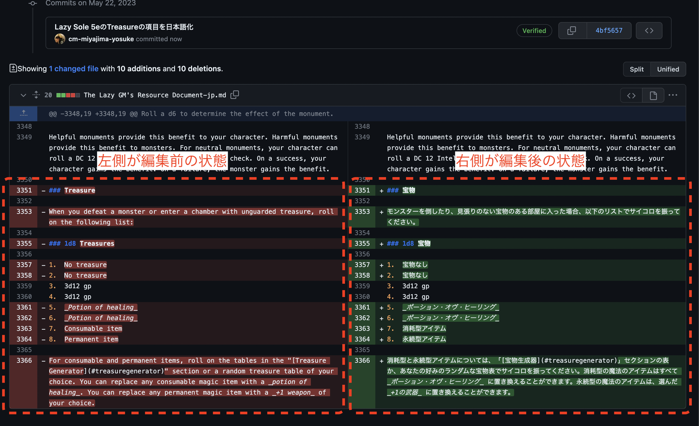

「Create pull request」をクリックした先の画面で、もう一度「Creaate pull request」というボタンをクリックすると、編集結果が提出されます。
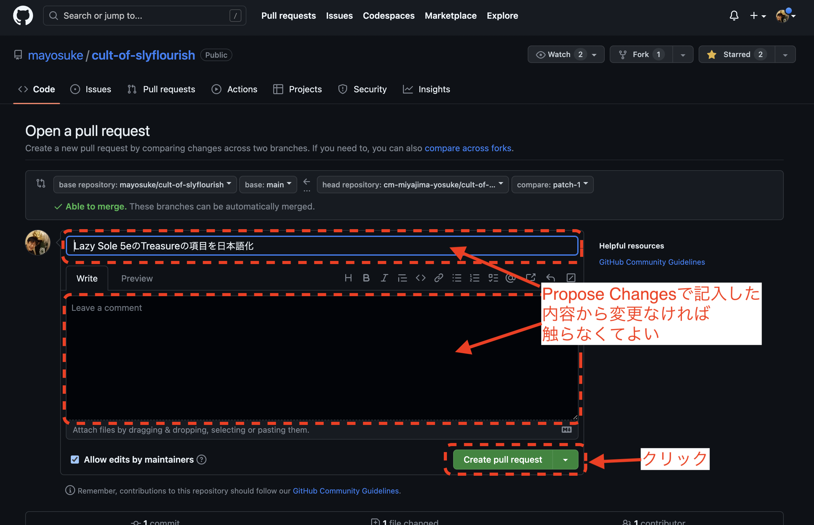

編集結果が提出されました。

提出内容が問題無ければ、リポジトリ管理者(現在はmayosuke)によって編集内容がドキュメントにマージされます。

### マージ結果確認

提出内容がマージされたら、自分のアカウントのメールアドレス宛にマージされた事がメールされます。

[The Lazy GM's Resource Document-jp.md](The%20Lazy%20GM's%20Resource%20Document-jp.md)を開いて編集内容が反映されたことを確認して、一連の編集作業は完了です。

編集の履歴をここから辿ることもできます。
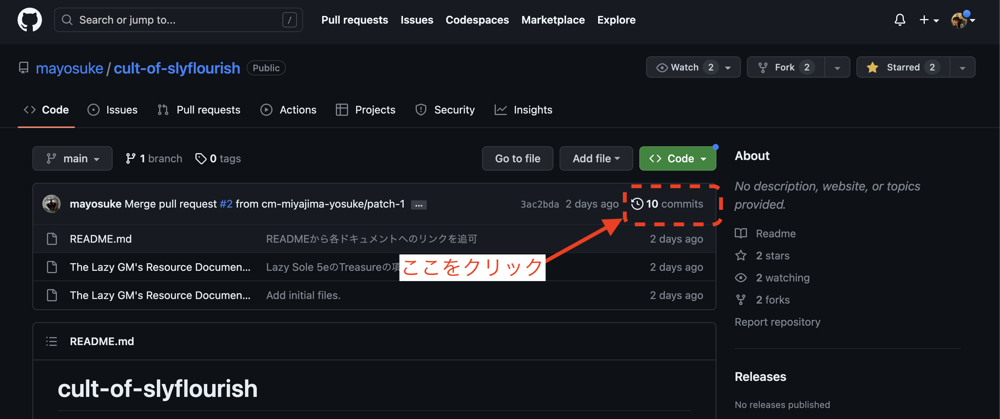

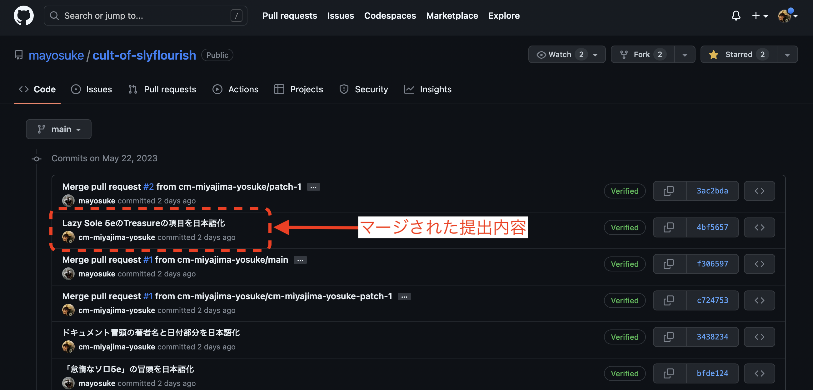

## 参考

マークダウンの編集Tipsについては、以下などを参考にしてみてください。

- [Qiita Markdown 早見メモ - Qiita](https://qiita.com/iiokazuya/items/21ae40c1ee8ec9acd484)

## お断り

Git/GitHubの機能・仕組みなどについて、正確でない表現になっている可能性があります。Git/GitHubにあまり詳しくない方でも、なるべく戸惑わずに編集作業に参加できることを目的としているためですので、ご了承ください。
